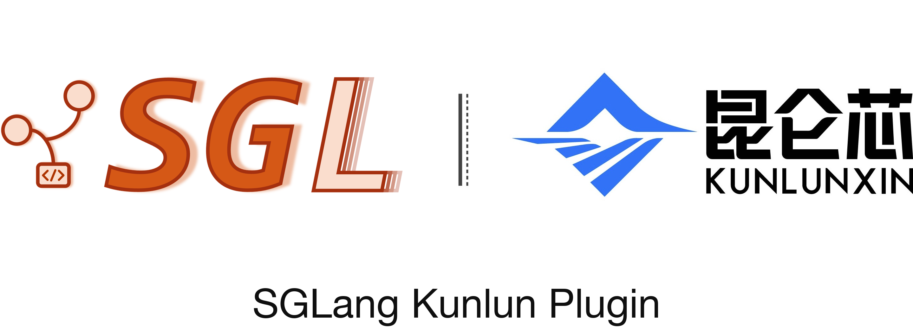

<p align="center">
  <a href="#overview"><b>📖 Overview</b></a> |
  <a href="#quick-start"><b>🚀 Quick Start</b></a> |
  <a href="#installation"><b>📦 Installation</b></a> |
  <a href="#architecture"><b>🧩 Architecture</b></a> |
  <a href="CONTRIBUTING.md"><b>💬 Contributing</b></a>
</p>

<p align="center">
  
  
  
  
  
</p>

---

**SGLang Kunlun** (`sglang-kunlun`) is an out-of-tree (OOT) hardware platform
plugin designed to seamlessly run [SGLang](https://github.com/sgl-project/sglang)
on the **Kunlun XPU**. It registers the Kunlun platform through SGLang entry
points and keeps Kunlun-specific bootstrap, runtime hooks, and kernels outside
the SGLang source tree.

---

## Latest News 🔥

- [2026/09] ✨ **Open-source engineering** — Added governance and community
  files (code of conduct, security policy, DCO, issue/PR templates,
  pre-commit, and pytest configuration) aligned with industry-standard
  open-source practices
- [2026/06] 🌟 **Initial release of SGLang Kunlun** — The `sglang-kunlun`
  package was created at version `0.1.0`
- **Current development** — Kunlun platform registration, runtime bootstrap,
  attention, KV-cache, MoE, quantization, speculative decoding, and
  disaggregation hooks are maintained in this repository

---

## Overview

The plugin exposes the following SGLang entry points:

- `sglang.srt.platforms`: registers the `kunlun` platform.
- `sglang.srt.plugins`: registers the Kunlun general hooks.
- `sglang-kunlun-launch`: provides an explicit Kunlun launcher when the
  standard SGLang launcher is not sufficient for a deployment.

The platform activation is conditional: on a machine where `torch_xmlir` is
available, the plugin activates `KunlunSRTPlatform`; otherwise it returns
`None` and does not take over platform discovery.

### ✨ Key Features

- **Out-of-tree integration** — Integrates with SGLang through Python entry
  points and hooks instead of modifying the SGLang source tree.
- **Kunlun bootstrap** — Applies import-order and CUDA-compatible compatibility
  shims needed by the Kunlun runtime.
- **Attention and graph integration** — Provides the Kunlun attention backend,
  speculative-decoding attention paths, and graph-runner integration.
- **KV-cache management** — Provides Kunlun MHA/MLA/DSA KV pools and a paged
  KV-cache allocator.
- **MoE and quantization hooks** — Includes Kunlun paths for fused MoE,
  token dispatch, and INT8/W8A8-related operations.
- **Speculative decoding** — Includes EAGLE and multi-layer EAGLE hooks.
- **Disaggregation hooks** — Includes integration points for Prefill/Decode
  disaggregation and Mooncake/RDMA-based KV transfer. Validate this path in
  the target runtime before using it in production.
- **OpenAI-compatible serving** — Uses SGLang's OpenAI-compatible server
  interface once the Kunlun platform has been initialized.

---

## Prerequisites

- **Hardware**: Kunlun XPU (the deployment example below targets Kunlun3 P800)
- **OS**: Linux with a compatible Kunlun driver and runtime
- **Software**:
  - Python `>= 3.10`
  - Kunlun-enabled PyTorch with `torch_xmlir` available
  - A SGLang checkout/runtime and `sgl-kernel` checkout compatible with this
    repository. The exact SGLang and runtime versions are deployment-specific;
    keep them aligned with the current branch

The repository's Python packaging metadata is in
[`pyproject.toml`](pyproject.toml), and the test/build dependencies are listed
in [`requirements.txt`](requirements.txt).

---

## Installation 📦

Set `YOUR_PATH` to the workspace containing `sglang-kunlun` and the compatible
SGLang runtime, then install this package in editable mode:

```bash
YOUR_PATH=/path/to/your/workspace
pip install -e "${YOUR_PATH}/sglang-kunlun"
```

---

## Quick Start 🚀

### Start an OpenAI-Compatible API Server

Configure the Kunlun runtime environment first. The following values are the
startup configuration for the current MiMo-V2-Flash W8A8 INT8 example.
Adjust device visibility and model-specific kernel options for your
deployment.

```bash
YOUR_PATH=/path/to/your/workspace

unset XPU_DUMMY_EVENT
export PYTHONPATH="${YOUR_PATH}/sglang-kunlun:${YOUR_PATH}/aiak_sglang/python:${YOUR_PATH}/aiak_sglang/sgl-kernel/python"
export SGLANG_IS_FLASHINFER_AVAILABLE=False
export SGLANG_SKIP_SGL_KERNEL_VERSION_CHECK=1
export SGLANG_SET_CPU_AFFINITY=1
export XMLIR_FORCE_USE_XPU_GRAPH=1
export XPU_USE_FAST_SWIGLU=1
export XPU_USE_DEFAULT_CTX=1
export XMLIR_ENABLE_FAST_FC=1
export XMLIR_CUDNN_ENABLED=1
export CUDA_GRAPH_OPTIMIZE_STREAM=1

# The standard launcher discovers Kunlun through the installed entry points.
# Do not set these before Python starts; sitecustomize bootstraps XPU too early.
unset SGLANG_PLATFORM SGLANG_USE_XPU
```

Then start the server:

```bash
SGLANG_ENABLE_SPEC_V2=1 
python3 -u -m sglang.launch_server \
    --model-path /home/models/MiMo-V2-Flash-W8A8-INT8-Dynamic-official \
    --speculative-algorithm EAGLE \
    --quantization w8a8_int8 \
    --max-total-tokens 650000 \
    --disable-radix-cache \
    --decode-log-interval 1 \
    --host 0.0.0.0 \
    --port 8806 \
    --trust-remote-code \
    --tp-size 8 \
    --max-running-requests 64 \
    --disable-overlap-schedule \
    --attention-backend fa3 \
    --disable-cuda-graph \
    --mem-fraction-static 0.85
```

> **Note**: The command above is an example deployment configuration.
> `--model-path`, `--tp-size`, memory allocation, attention backend, and
> speculative-decoding settings must match the model and Kunlun runtime
> installed on the target machine.

### Send a Request

List the model identifier exposed by the running server before sending a chat
request:

```bash
curl http://localhost:8806/v1/models
```

Then send a request using the model identifier returned by that endpoint:

```bash
curl http://localhost:8806/v1/chat/completions \
  -H "Content-Type: application/json" \
  -d '{
    "model": "<model-id-from-v1-models>",
    "messages": [{"role": "user", "content": "Hello!"}],
    "max_tokens": 512
  }'
```

---

## Compatibility Notes

This repository is a platform plugin rather than a complete SGLang
distribution. Model support depends on the SGLang version, Kunlun runtime,
operator libraries, model weights, and launch configuration being compatible.
The table below records paths explicitly represented in the current code; it
is not a complete compatibility matrix.

| Model or path | Evidence in this repository | Notes |
| --- | --- | --- |
| MiMo-V2-Flash | Current W8A8 INT8 launch example | Use the example only with a matching model/runtime environment. |
| DeepSeek-V4 | DeepSeek-V4 model and KV-cache compatibility hooks | Runtime acceptance must be verified with the target SGLang/Kunlun versions. |
| Other SGLang models | General platform, attention, KV-cache, MoE, and quantization hooks | Validate each model family and quantization mode separately. |

---

## Version Matrix

| Component | Version or branch | Source |
| --- | --- | --- |
| `sglang-kunlun` | `0.1.0` | [`pyproject.toml`](pyproject.toml) |
| Development code | `main` | Current repository branch |
| SGLang and Kunlun runtime | Deployment-specific | Must match the current plugin branch |

---

## Architecture 🧩

```text
sglang-kunlun/
├── sglang_kunlun/
│   ├── platform/              # Kunlun device and SGLang platform entry point
│   ├── bootstrap/             # Import-order, runtime, and compatibility shims
│   ├── hooks/
│   │   ├── layers/             # Attention, MoE, linear, rotary, and quantization hooks
│   │   ├── mem_cache/          # Kunlun KV pools and paged allocator
│   │   ├── model_executor/     # Model-runner and KV-cache integration
│   │   ├── models/             # Model-specific hooks, including DeepSeek-V4
│   │   ├── speculative/        # EAGLE and multi-layer EAGLE hooks
│   │   ├── disaggregation/     # Prefill/Decode and KV-transfer hooks
│   │   └── entrypoints/        # HTTP server integration hooks
│   ├── kernels/                # Kunlun kernel shims and operator replacements
│   ├── models/                 # External model package registration
│   └── launch.py               # Explicit Kunlun launcher
├── test/                       # Unit and contract tests
├── build/                      # Repository packaging scripts
├── pyproject.toml              # Package metadata and SGLang entry points
├── requirements.txt            # Build and test dependencies
├── LICENSE                     # Apache License 2.0
└── NOTICE                      # Copyright and third-party notices
```

---

## Development and Validation

Run the repository tests in an environment with the required Python
dependencies installed:

```bash
python3 -m pytest -q
```

The CI packaging script creates `output/sglang_kunlun.tar.gz`:

```bash
sh build/build.sh
```

For changes affecting runtime behavior, validate on the target Kunlun
environment with the relevant model, quantization mode, parallelism, and
graph/disaggregation settings. A passing unit-test run alone does not establish
end-to-end inference or performance correctness.

---

## Contributing

We welcome contributions from the community! Please read our
[Contributing Guide](CONTRIBUTING.md) before submitting a PR.

### Community

- 📜 [**Code of Conduct**](CODE_OF_CONDUCT.md) — All contributors are expected to follow our code of conduct
- ✍️ [**Developer Certificate of Origin**](DCO) — Please sign off your commits with `git commit -s`; see [MAINTAINERS.md](MAINTAINERS.md) for the maintainer list
- 🔒 [**Security Policy**](SECURITY.md) — Report security vulnerabilities privately

### PR Classification

Use the following prefixes for PR titles:

- `[Platform]` — Platform activation and device integration
- `[Attention]` — Attention backends and KV-cache access
- `[Kernel]` — Kernel shims and operator implementations
- `[MoE]` — MoE, routing, and token-dispatch paths
- `[Quantization]` — Quantization and dequantization paths
- `[Speculative]` — EAGLE or other speculative-decoding paths
- `[PD]` — Prefill/Decode disaggregation and KV transfer
- `[Bugfix]` — Bug fixes
- `[Doc]` — Documentation improvements
- `[Test]` — Tests
- `[CI]` — CI or packaging improvements
- `[Misc]` — Other changes

---

## Star History 🔥

We opened the project on Jun 2026. We love open source and collaboration ❤️

<a href="https://www.star-history.com/?repos=baidu-baige/sglang-kunlun&type=date&legend=top-left">
  <picture>
    <source media="(prefers-color-scheme: dark)" srcset="https://api.star-history.com/chart?repos=baidu-baige/sglang-kunlun&type=date&theme=dark&legend=top-left" />
    <source media="(prefers-color-scheme: light)" srcset="https://api.star-history.com/chart?repos=baidu-baige/sglang-kunlun&type=date&legend=top-left" />
    
  </picture>
</a>

---

## Sponsors 👋

We sincerely appreciate the [**KunLunXin**](https://www.kunlunxin.com/) team
for their support in providing XPU resources, which enabled efficient model
adaptation debugging, comprehensive end-to-end testing, and broader model
compatibility.

---

## License

Apache License 2.0, as found in the [LICENSE](./LICENSE) file. See
[`NOTICE`](NOTICE) for copyright attribution and third-party software notices.